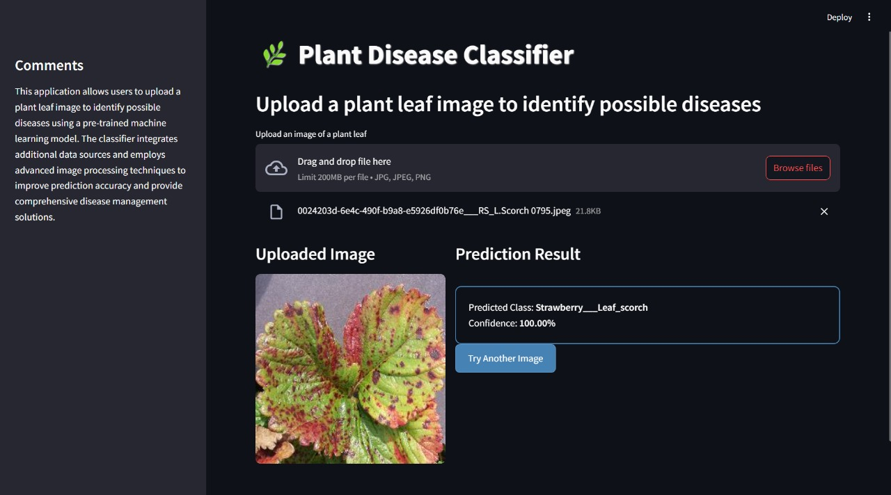

# 🌿 Plant Disease Classifier

A deep learning-powered web application that identifies plant leaf diseases from uploaded images. Built using **TensorFlow**, **Streamlit**, and **OpenCV**, this tool helps in early detection of plant diseases, aiding smart agriculture and crop management.

## 🌐 Live Demo

👉 [Click here to try the Plant Disease Classifier](https://rishabh-o36-leaf-scan.streamlit.app)

---

## 🚀 Features

- 📷 Upload a plant leaf image
- 🌿 Automatically detects if the image contains a leaf
- 🔍 Classifies the disease using a trained CNN model
- 📊 Displays prediction confidence score
- 📚 Provides a clean and interactive web interface using Streamlit

---

## 🧠 Model Details

- **Architecture**: Trained on a custom CNN or pre-trained model (e.g., MobileNet/ResNet).
- **Dataset**: Based on the [PlantVillage Dataset](https://www.kaggle.com/emmarex/plantdisease).
- **Classes**: Includes various plant types and their healthy/diseased states.
- **Input Size**: 224x224 RGB images.

---

## 🛠 Tech Stack

| Technology | Purpose |
|------------|---------|
| **TensorFlow/Keras** | Model training & prediction |
| **Streamlit** | Web interface |
| **OpenCV** | Leaf detection & image validation |
| **NumPy / PIL** | Image preprocessing |
| **JSON** | Class mapping |

---

## 🧪 How It Works

1. User uploads an image via the browser.
2. The system checks if it looks like a **leaf** (based on green pixel analysis).
3. If valid, the image is preprocessed and passed to the **trained model**.
4. Prediction is displayed with **class name** and **confidence score**.

---

## 📂 Project Structure

